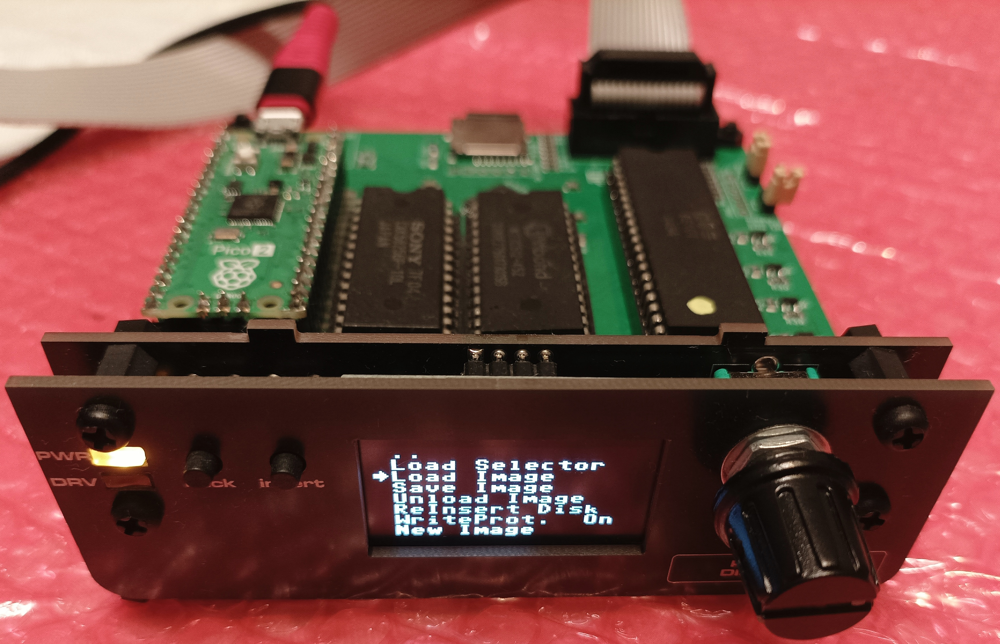
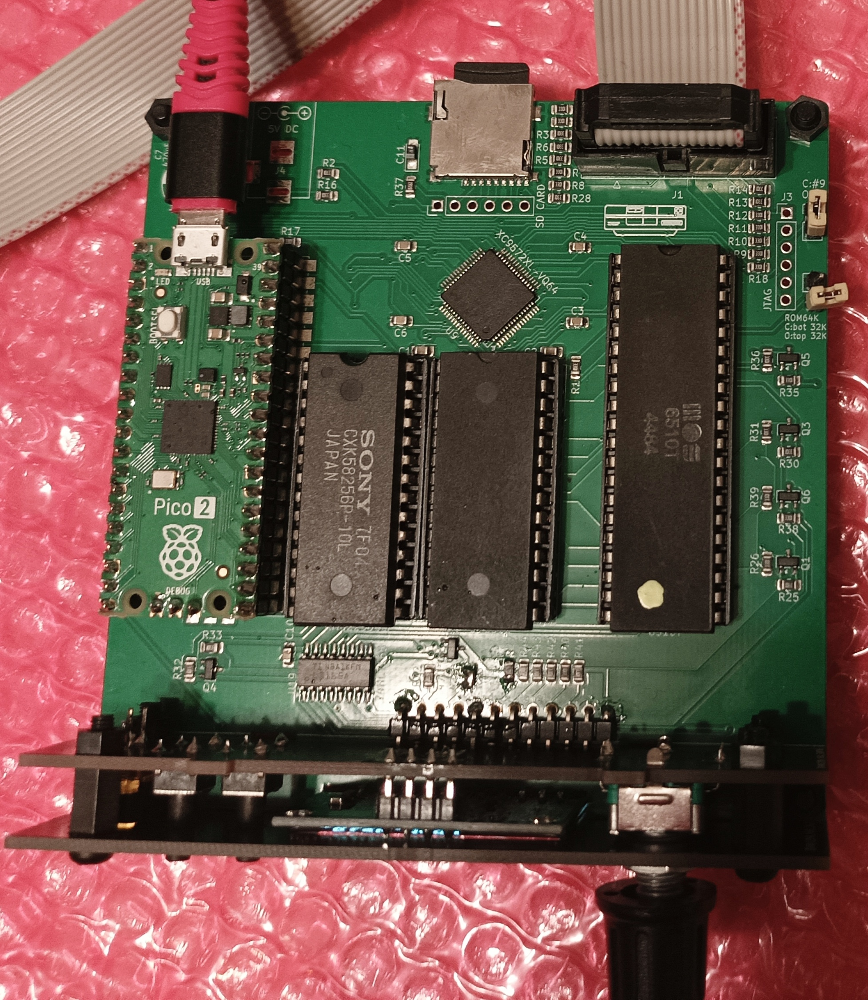
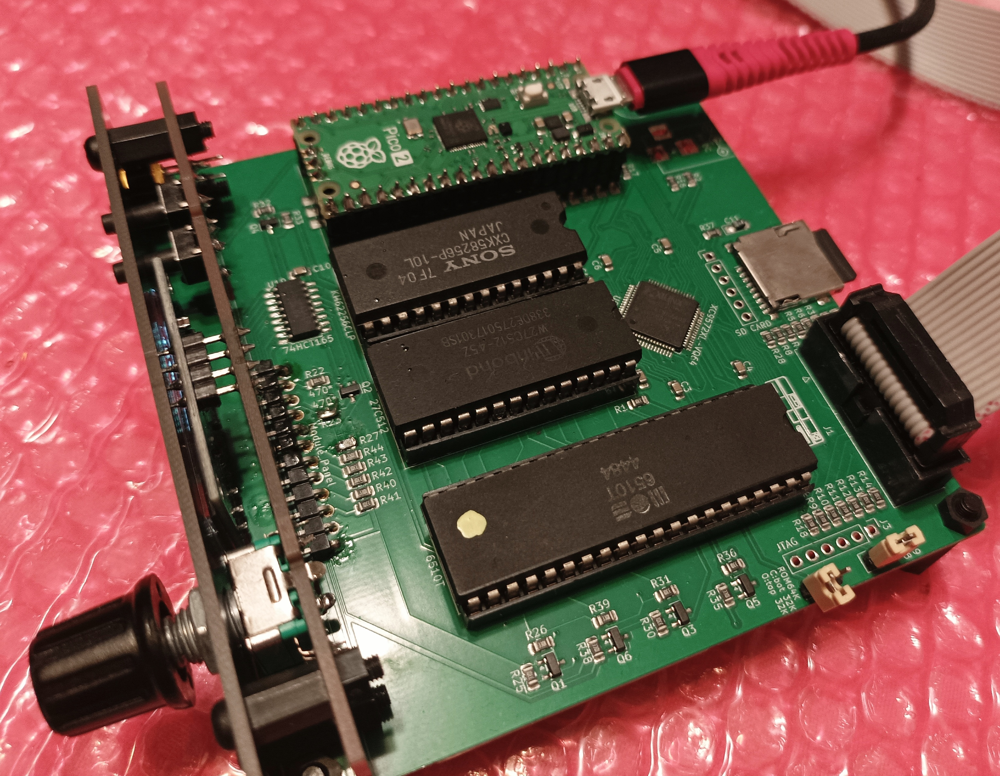

# 1551-rePico

[](https://github.com/ytmytm/1551-rePico/actions/workflows/build.yml)

Commodore **1551** disk-drive replacement for **Plus/4 / C16 / C116**, based on a [Raspberry Pi Pico 2](https://www.raspberrypi.com/products/raspberry-pi-pico-2/) (RP2350, **non-wireless** — raspberry logo on the soldermask; not Pico 2 W). Firmware and GCR/SD logic are derived from [1541-rePico](https://github.com/fook42/1541-rePico) / [1541-rebuild](https://github.com/ThKattanek/1541-rebuild).






## What this is

A self-contained **drive computer** — **Pico 2** + **6510T** (or [MOS CPU Replacer](https://github.com/monotech/MOS_CPU_Replacer)) + XC9572XL CPLD + RAM + ROM — that replaces the Pi1551-III mainboard (Raspberry Pi 3 + TCBM). It reuses the Pi1551-III **mechanical stack**: front panel, top/bottom faceplates, and overall assembly. BOM, Gerbers, and build notes for those parts stay in the [Pi1551-III](https://github.com/ytmytm/Pi1551-III) repository.


The finished device connects to the computer through a ribbon cable to **[plus4-tcbm2sd](https://github.com/ytmytm/plus4-tcbm2sd)** — same as Pi1551-III.

In short: same case and front panel as Pi1551-III; this repo supplies the Pico 2 / 6510T mainboard, CPLD bitstream, DOS ROMs, and firmware.

### Repository layout

| Path | Role |
|------|------|
| `firmware-1551-III-pico/` | **Supported** firmware |
| `hardware-1551-III-Pico/` | **Supported** KiCad mainboard |
| `hdl-1551-III/` | **Supported** CPLD (`Fake6523`) |
| `roms/` | **Supported** 1551 DOS images for the 27C512 (see [`roms/README.md`](roms/README.md)) |
| `no-OS-FatFS-SD-SDIO-SPI-RPi-Pico/` | Shared FatFs/SD submodule |
| `tools/` | Optional host helper (`conv_x64` D64↔G64); see [`tools/README.md`](tools/README.md) |
| `experimental/` | **Archival only** — early plug-over-1551 daughterboard + old firmware (see [`experimental/README.md`](experimental/README.md)) |

### Compared to a stock 1551

| Stock 1551 | This board |
|------------|------------|
| **6510T** CPU | Same **6510T**, or a [MOS CPU Replacer](https://github.com/monotech/MOS_CPU_Replacer) in that socket |
| ~2 KB SRAM | **32 KB** SRAM (`KM62256`) with a **1551-RAMBoard-style** map: `$0000–$3FFF` + `$8000–$9FFF` (extra RAM window; decode in the CPLD) |
| ~16 KB ROM | **64 KB** EPROM (`27C512`): two **32 KB** DOS images, selected by jumper **J2** — burn a [1551-RAMBOard](https://github.com/ytmytm/1551-RAMBOard) 64K image from [`roms/`](roms/) |
| Device #8 / #9 (hardware strap) | Jumper / strap for **device 8 or 9** (same idea as stock) |
| **6523** TPI + discrete address decode | **XC9572XL CPLD** (`hdl-1551-III/` Fake6523): TPI replacement **and** RAM/ROM chip-select decode |
| 2 MHz crystal (Phi0) | **Pico 2** generates **2 MHz Phi0** (PWM) |
| ~100 Hz IRQ oscillator | **Pico 2** generates **100 Hz IRQ** (PWM) |
| Analog floppy + mech | **Pico 2** emulates the analog path and runs the UI |

### Pico 2 on this board

- **Phi0** and **IRQ** as in the table above — those clocks take dedicated GPIOs that a stock gate-array / discrete oscillator would otherwise free up
- Supplies **3.3 V** for the CPLD (and other 3.3 V rails on this board)
- Front-panel **UI**: OLED (I2C), plus rotary encoder, Back/Insert, SD card-detect, and DS0/DS1 via a **74HCT165** (same panel as Pi1551-III). The '165 is needed because after clock, IRQ, floppy bus, SPI SD, and I2C there were not enough GPIOs for every panel line directly
- **SD card**: FatFs images, browser UI, **card-detect hotplug**
- Floppy **datastream**: GCR to/from the “head”, **BYTE_READY** / related timing
- **Stepper**, optional **density** from DS0/DS1, **WPS** / disk-change toward DOS, activity LED

### CPLD role (short)

Bidirectional **ports** (TCBM on A, head data on B, handshake / MODE / DEVNUM / SYNC on C) are based on [ZXByteman/Fake6523](https://github.com/ZXByteman/Fake6523). The same chip is also **logic glue**:

- RAMBOard-style **address decode** (`/RAMSEL`, `/RAMOE`, `/ROMSEL`, TPI `/CS`), all **PHI2-qualified**
- **`XR/~W`** for SRAM `/WE` (qualified with PHI2)
- **`byte_latched`**: Pico 2 strobes `byte_ready_3v3`; the CPLD latches on the falling edge; any CPU access to the TPI window (`$4000–$7FFF`, e.g. DOS `BIT $4000`) clears the latch — the classic floppy byte-ready behaviour from 1541/1571 service docs, without a dedicated 1551 manual

## What you can do with it

- Mount **D64**, **G64**, and **PRG** images from an SD card (PRG is wrapped on the fly into a temporary D64). Format notes: [D64](doc/D64.TXT), [G64](doc/G64.TXT); optional PC conversion with [`tools/conv_x64`](tools/)
- Browse and mount images from the **OLED + encoder** front panel (Back / Insert), with **SD hotplug** when the socket has a card-detect switch
- Run as device **#8 or #9** on the Plus/4 TCBM bus via **[plus4-tcbm2sd](https://github.com/ytmytm/plus4-tcbm2sd)**
- Use **[1551-RAMBOard](https://github.com/ytmytm/1551-RAMBOard)** patched DOS in the 27C512 so track-cache / HypaRAM-style fastloaders work
- Prefer **[Parobek](https://github.com/ytmytm/plus4-parobek)** as the host utility ROM: it autodetects the RAMBOard DOS patch and provides a fastloader. For now we use Parobek’s **DirectoryBrowser** on the computer; `firmware-1551-III-pico/SoftwareC16/db12b.prg` is kept for a future on-device Load Selector (**TODO**)

## Build and assemble

### 1. Clone (with submodules)

The FatFs/SD driver is a **git submodule**. Without it, CMake will fail.

```bash
git clone --recurse-submodules https://github.com/ytmytm/1551-rePico.git
cd 1551-rePico
```

If you already cloned without submodules:

```bash
git submodule update --init --recursive
```

You need at least `no-OS-FatFS-SD-SDIO-SPI-RPi-Pico/` for the supported firmware.

### 2. Host packages

**Linux (Debian-like):**

```bash
sudo apt install cmake ninja-build libusb-1.0-0-dev build-essential \
  pkg-config python3 xxd gcc-arm-none-eabi \
  libnewlib-arm-none-eabi libstdc++-arm-none-eabi-newlib
```

**macOS (Homebrew):**

```bash
brew install cmake ninja libusb pkg-config python3
brew install --cask gcc-arm-embedded
```

`xxd` is usually already on macOS (Xcode Command Line Tools). Ensure `arm-none-eabi-gcc` is on your `PATH`.

### 3. Raspberry Pi Pico SDK

From [pico-sdk](https://github.com/raspberrypi/pico-sdk):

```bash
git clone https://github.com/raspberrypi/pico-sdk.git
cd pico-sdk
git submodule update --init lib/mbedtls
export PICO_SDK_PATH="$(pwd)"
echo "export PICO_SDK_PATH=$PICO_SDK_PATH" >> ~/.profile
```

Open a new shell (or `source ~/.profile`) so `PICO_SDK_PATH` is set. The Raspberry Pi Pico VS Code extension / `.pico-sdk` can provide the SDK instead.

### 4. picotool

From [picotool](https://github.com/raspberrypi/picotool): clone and build/install as in its README / BUILDING.md so `picotool` is on your `PATH`.

### 5. Compile firmware

```bash
cd firmware-1551-III-pico
mkdir -p build && cd build
cmake -G Ninja -DCMAKE_BUILD_TYPE=Release ..
ninja
```

Outputs include `1551-III-Pico.uf2` and `1551-III-Pico.elf`.

### 6. Flash the Pico 2

```bash
picotool load -t uf2 1551-III-Pico.uf2 -x -f
```

`-f` forces BOOTSEL when the app is running; `-x` starts the new firmware after load.

### 7. Main PCB (order / solder)

KiCad project: [`hardware-1551-III-Pico/`](hardware-1551-III-Pico/) (see its [`README.md`](hardware-1551-III-Pico/README.md)).

- Schematic PDF: [`plots/1551-III-Pico.pdf`](hardware-1551-III-Pico/plots/1551-III-Pico.pdf)
- Gerbers / drills: [`plots/`](hardware-1551-III-Pico/plots/)
- Fab pack: [`production/1551-III_Pico_2b.zip`](hardware-1551-III-Pico/production/1551-III_Pico_2b.zip)
- BOM / pick-and-place: [`production/bom.csv`](hardware-1551-III-Pico/production/bom.csv), [`positions.csv`](hardware-1551-III-Pico/production/positions.csv), [`designators.csv`](hardware-1551-III-Pico/production/designators.csv)
- **JP1–JP3**: leave default **1–2** (Pico 2 ↔ `74HCT165`). Alternate wiring was only insurance if the shift register failed — do not change them.

### 8. Program the CPLD

Flash [`hdl-1551-III/Fake6523.jed`](hdl-1551-III/Fake6523.jed) into the XC9572XL. The `.jed` was built with [Xilinx ISE 14.7](https://www.xilinx.com/support/download/index.html/content/xilinx/en/downloadNav/vivado-design-tools/archive-ise.html) (sources in `hdl-1551-III/`). Rebuild and JTAG steps (a Raspberry Pi 3 and jumper wires are enough) are in [plus4-tcbm2sd → CPLD firmware](https://github.com/ytmytm/plus4-tcbm2sd/blob/main/HardwareFirmware.md#cpld-firmware); the procedure is the same for this board.

### 9. Burn the DOS ROM

Program a 64K image from [`roms/`](roms/) into the 27C512 (see [`roms/README.md`](roms/README.md)). Prefer a [1551-RAMBOard](https://github.com/ytmytm/1551-RAMBOard) image; jumper **J2** selects the active 32K half (use the patched upper bank).

### 10. Panel, case, and host link

- Front panel / faceplates / mechanical assembly: **[Pi1551-III](https://github.com/ytmytm/Pi1551-III)**
- Host: **[plus4-tcbm2sd](https://github.com/ytmytm/plus4-tcbm2sd)** + ribbon cable

## History and relation to 1541-rePico

This is a **separate product**, not a fork kept in sync with upstream 1541-rePico: a real **6510T** + CPLD 1551 path in a [Pi1551-III](https://github.com/ytmytm/Pi1551-III) enclosure. Useful upstream changes may still be cherry-picked by hand.

**Starting point.** Take 1541-rePico’s GCR/SD/UI core and aim at a **1551** for Plus/4 that still fits **Pi1551-III** and talks through **tcbm2sd**, so the Pi 3 Module-rotated board becomes a Pico 2 + real 6510T path.

**Daughterboard bring-up** (now `experimental/`). First hardware plugged over a stock 1551 mainboard: reuse CPU/TPI/RAM/ROM, Pico 2 for the analog path, Fake6523 in the CPLD. That proved TCBM/GCR, pin maps, and design rules: Phi0 and 100 Hz IRQ from the Pico 2 (gate array optional), `XR/~W` in the CPLD, PHI2-qualified chip-selects (otherwise RAM bus contention), `byte_latched` as classic byte-ready, and slower zone-0 timing than 1541 defaults. Once the motherboard was only a RAM/ROM carrier, a self-contained board was the next step.

**1551-III-Pico.** Decode moved into the CPLD (no discrete `'139`/`'00`), RAMBOard map and 64K DOS images, Pi1551-III panel (SH1106 + 74HCT165). Firmware lives in `firmware-1551-III-pico/`. Upstream 1541-rePico is not merged as a whole — only occasional hand cherry-picks.

| Mostly from 1541-rePico | Mostly new for 1551 / this board |
|-------------------------|----------------------------------|
| GCR encode/decode, track buffers, D64/G64 path | KiCad III board, CPLD glue + Fake6523 ports, RAMBOard decode |
| FatFs / SD wiring, much of the menu framework | Pico 2 as Phi0 + 100 Hz IRQ; '165 panel inputs |
| Build/flash with pico-sdk / picotool | TCBM via tcbm2sd; Parobek + patched DOS ROMs |
| | Zone-0 timing, byte-ready latch model, SD hotplug, III pinout |

### Credits

- [1541-rebuild](https://github.com/ThKattanek/1541-rebuild) — Thorsten Kattanek  
- [1541-rePico](https://github.com/fook42/1541-rePico) — fook42 (GCR/SD/UI lineage)  
- C64 image selector in upstream 1541-rePico — Peiselulli  
- Dev-container / debug docs on upstream — [BensonRSI](https://github.com/BensonRSI)  
- [Fake6523](https://github.com/ZXByteman/Fake6523) — ZXByteman / go4retro  
- [Pi1551-III](https://github.com/ytmytm/Pi1551-III), [plus4-tcbm2sd](https://github.com/ytmytm/plus4-tcbm2sd), [1551-RAMBOard](https://github.com/ytmytm/1551-RAMBOard), [plus4-parobek](https://github.com/ytmytm/plus4-parobek)

## Links

- Disk image formats overview: <https://ist.uwaterloo.ca/~schepers/formats.html>
- forum64 thread behind 1541-rebuild / 1541-rePico: <https://www.forum64.de/index.php?thread/59884-laufwerk-der-1541-emulieren>
