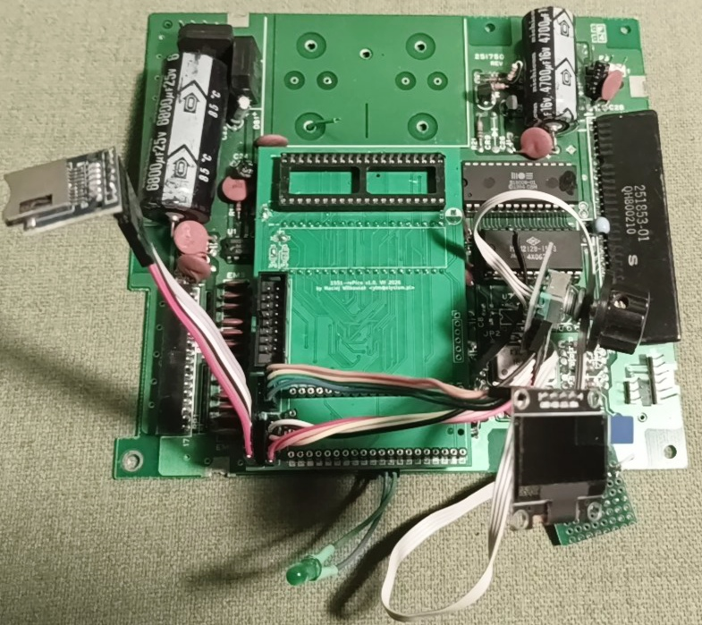

# Experimental / archival (early 1551-rePico)

**Archival only.** Do not treat this tree as the supported product. It is kept for curious readers and for archaeology of the bring-up path that led to the current 1551-III-Pico board.

1551 mainboard remains with the experimental daughterboard plugged into CPU/TPI sockets.

Passthrough CPU socket is empty, the socket for Pico 2 is also not populated anymore.

Gate array was damaged and was replaced by 74'139 to split address space between RAM, TPI and ROM.

All the other I/O modules are connected: SD card, encoder, OLED and a single LED (to mainboard connector).

When running this board was powered by USB from Pico 2.

## What this was

Before **1551-III-Pico** (a self-contained Pico + CPLD + front-panel board that replaces the 1551 analog/disk electronics in a more finished form), we built a **daughterboard** that plugged over a stock Commodore 1551 mainboard. That let us reuse the real 6502/TPI/SRAM/ROM and experiment with:

- Pico replacing the floppy analog path (GCR, stepper, SD images)
- a CPLD **Fake6523** standing in for the 6523-side glue
- early Plus/4 / TCBM bring-up and pin mapping

That experiment proved the approach and informed the III hardware and firmware. It is **not** maintained and is **not** what you should build or flash for a release.

## Contents

| Path | Role |
|------|------|
| `hardware1551/` | KiCad project for the plug-over-1551-mainboard daughterboard |
| `hdl/` | Xilinx ISE CPLD project (`Fake6523`) for that daughterboard |
| `firmware/` | Fork of upstream **1541-rePico** firmware with `REPICO1551` adaptations used during daughterboard bring-up |

The **current** release artifacts live outside this folder:

- Hardware: `hardware-1551-III-Pico/`
- CPLD: `hdl-1551-III/`
- Firmware: `firmware-1551-III-pico/`
- Shared FatFs submodule (used by III firmware): `../no-OS-FatFS-SD-SDIO-SPI-RPi-Pico/`

## Firmware note

There was never a separate top-level `firmware-1551` tree. The early 1551 work lived inside the 1541-derived `firmware/` directory (now here). Product development continues only on **`firmware-1551-III-pico`**. Upstream 1541-rePico is no longer merged as a pull; at most, useful commits may be inspected and cherry-picked by hand into III firmware.

## Status

Frozen for history. Expect bitrot (tooling, pin maps, docs). Prefer III sources for anything you intend to ship or support.

`hardware1551/FABRICATION_CHECK_REPORT.md` and similar notes describe the **daughterboard** jumper map and bring-up checklist; they do **not** apply to `hardware-1551-III-Pico/`.
